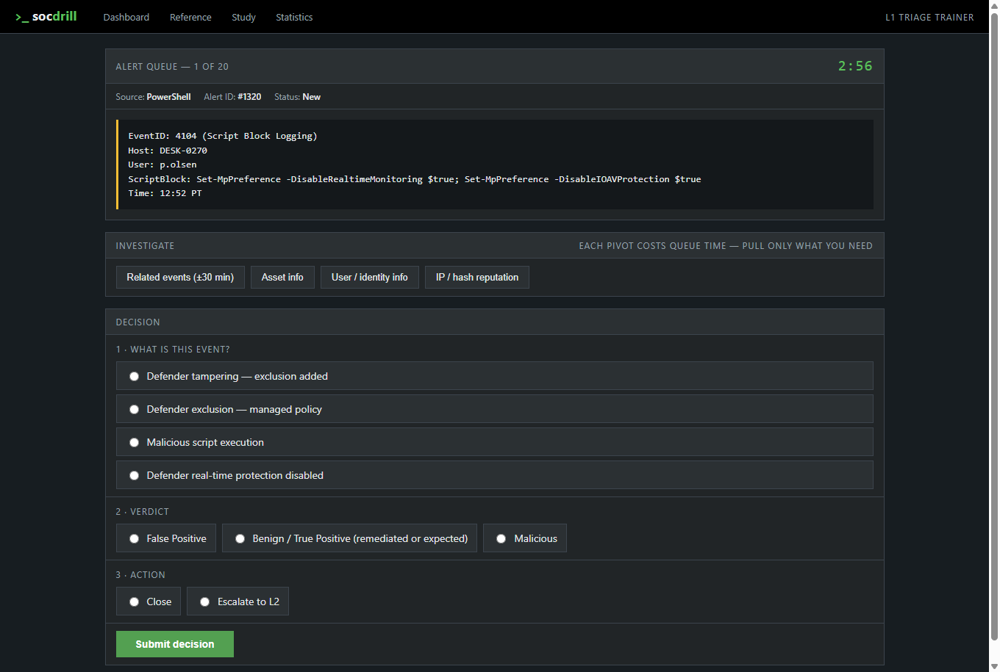
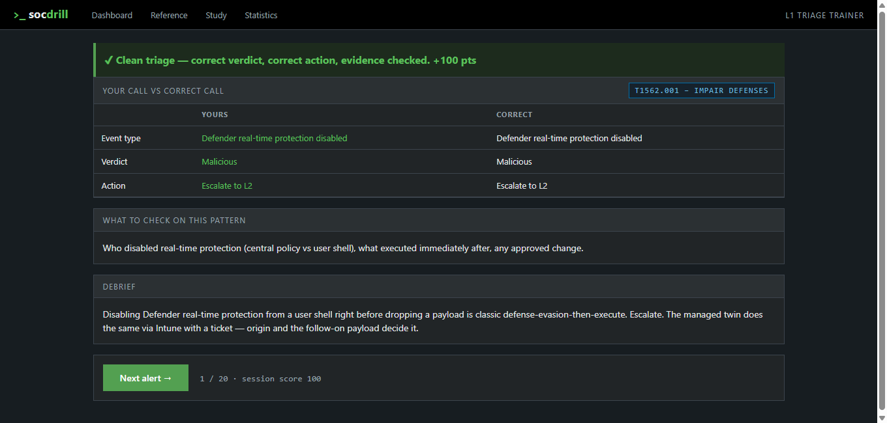

.# SOC L1 Drill

Alert-triage trainer for SOC Tier 1 skills. Splunk-style dark UI. Each card is a
mini-investigation, not a flashcard: read the alert, pull only the pivots you need
(related events, asset, identity, reputation), decide FP / benign / malicious,
close or escalate  then get an immediate debrief with the reasoning and the
MITRE ATT&CK technique.



*A live alert card: pull only the pivots you need, classify the event, then
decide verdict and action against a 3:00 clock.*



*The debrief after each call: your answer against the correct one, the MITRE
ATT&CK technique, what to check on this pattern, and the reasoning.*

## Content
- 93 scenario templates × 20 rendered variants = **1,860 scenarios** (usernames, IPs,
  hosts, timestamps randomized so you learn the pattern, not the card)
- Sources: Windows Security, PowerShell 4104, Sysmon, Microsoft Defender, Microsoft Sentinel
- Deliberate FP/TP pairs of the *same alert type* (quarantine that worked vs quarantine
  that fired after execution; impossible travel vs SWG egress artifact; LSASS access
  by Mimikatz vs by MsMpEng)  the pivots are what separate them

## Mechanics
- 3:00 timer per alert; timeout = 0 points
- Scoring: verdict 50 / action 30 / event classification 10 / evidence bonus +10;
  correct verdict **without** checking required pivots = −15 (a guess is not triage);
  excess pivots −3 each
- Spaced repetition: missed scenarios get weight ×2, **malicious-closed critical
  misses ×3**, clean triage ×0.6
- Stats: accuracy by telemetry source and ATT&CK technique, daily trend,
  critical-miss counter, avg triage time

## Run
```bash
docker compose up --build
# → http://localhost:8000
```
Data persists in the `drill-data` volume. To change corpus size:
`VARIANTS_PER_TEMPLATE` env var (only applies on first seed of an empty DB).

Without Docker:
```bash
pip install -r requirements.txt
DB_PATH=./drill.db uvicorn app.main:app --port 8000
```

## Add scenarios
Edit `app/seed_data.py` → `TEMPLATES`. Each template needs: alert text, four pivot
payloads, verdict, action, `required_pivots` (which pivots justify the verdict),
MITRE mapping, what-to-check checklist, debrief. Placeholders like `{user}`,
`{ext_ip}`, `{srv}` are rendered per-variant. Delete the DB (or volume) to reseed.

## Stack
FastAPI · SQLite · Jinja2 · vanilla JS · Docker Compose. No frontend framework.
